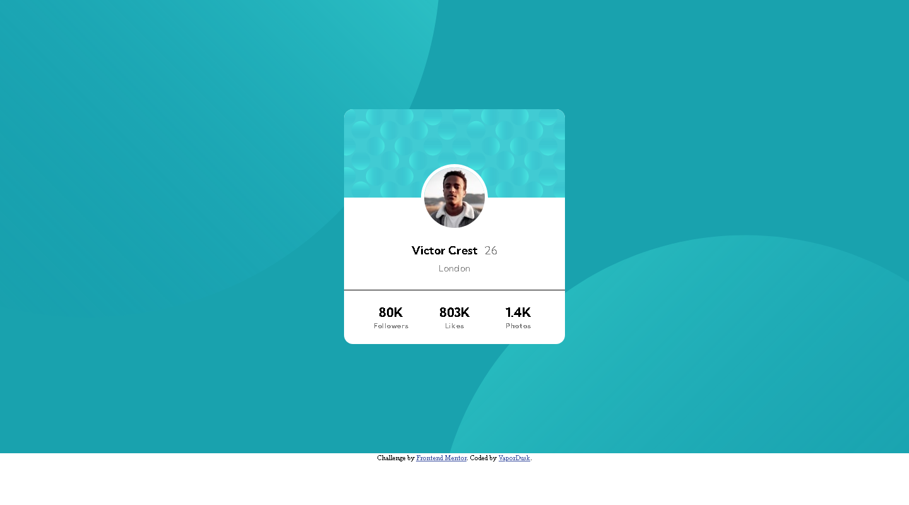

# Frontend Mentor - Profile card component solution

This is a solution to the [Profile card component challenge on Frontend Mentor](https://www.frontendmentor.io/challenges/profile-card-component-cfArpWshJ). Frontend Mentor challenges help you improve your coding skills by building realistic projects. 

## Table of contents

- [Overview](#overview)
  - [The challenge](#the-challenge)
  - [Screenshot](#screenshot)
  - [Links](#links)
- [My process](#my-process)
  - [Built with](#built-with)
  - [What I learned](#what-i-learned)
  - [Continued development](#continued-development)
  - [Useful resources](#useful-resources)
- [Author](#author)

## Overview

### The challenge

- Build out the project to the designs provided

### Screenshot

### Links

- Solution URL: [https://github.com/VaporDusk/profile-card-component-main]
- Live Site URL: [https://github.com/VaporDusk/profile-card-component-main/]

## My process

### Built with

- Semantic HTML5 markup
- CSS custom properties
- Flexbox
- Mobile-first workflow

### What I learned

- How does CSS and HTML works

### Continued development

Learn best practices and apply them
Continue to improve my HTML and CSS

### Useful resources

- (https://www.google.com/) - This helped me for every confusing and ignorence situation.

## Author

- Website - [https://github.com/VaporDusk]
- Frontend Mentor - [https://www.frontendmentor.io/profile/VaporDusk]
- Telegram - [@VaporDusk]